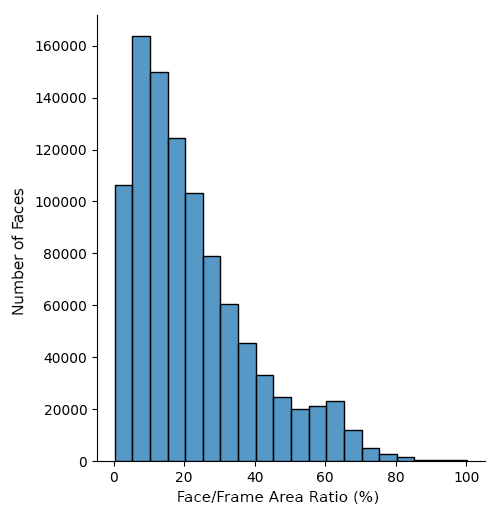
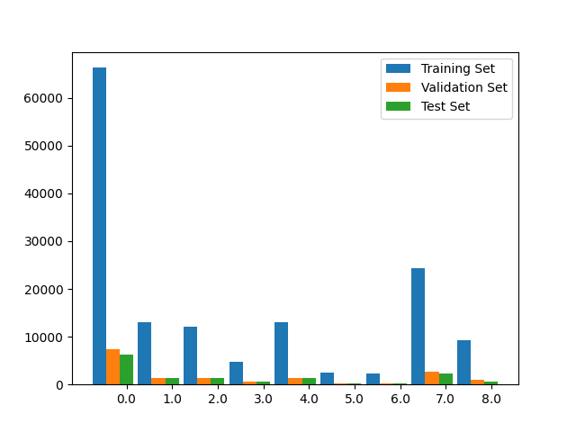
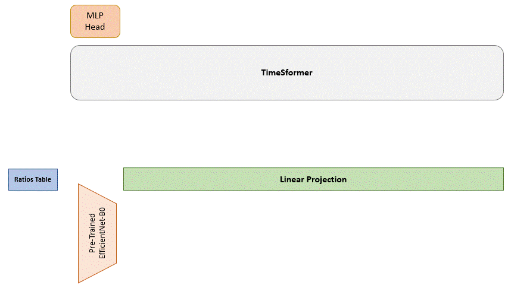

# Size Invariant Multi-Identity Transformer-based Architecture for Video Deepfake Detection using Space-Time Attention

## Motivations behind this study
The continuing advancement of deepfake generation techniques and the increasingly credible results obtained through these, makes it increasingly urgent to develop new techniques to distinguish a manipulated video from a real one. This is, however, a far from simple task that introduces multiple challenges to be overcome, challenges that form the basis of this research work. 
- Generalization of the Deepfake concept:  Deepfake generation methods tend to introduce specific anomalies within images and videos. Deepfake detection models often tend to learn to recognise these specific anomalies and are therefore ineffective in the real world when dealing with unseen manipulations. Our previous studies in this area suggest a greater capacity for generalisation by Vision Transformers than by Convolutional Neural Networks [<a href="https://arxiv.org/abs/2107.02612">Coccomini et al, 2022</a>];
- Ability to pick up both spatial and temporal anomalies within a video: Very often the anomalies that are searched for by deepfake detectors are exclusively spatial with frame-by-frame classifications. However, some important anomalies lie precisely in the variation of the face over time, which can be unnatural and thus allow a manipulated video to be identified;
- Scalability of models: In order to carry out an effective Deepfake Detection, one often tends to exploit large deep learning models or even ensemble techniques involving significant inference and training times; 
- Handling of multiple faces within the same video: A specific situation that can be exploited by an attacker to deceive a deepfake detection system is found in the case of videos or images with multiple faces (identities). An attacker could in fact decide to manipulate only one of the people in the video. However, if the detection is carried out en bloc for all the faces in the video, the negative contribution to the final prediction made by the fake faces could be 'masked' by the non-manipulated ones, thus deceiving the system.
- Management of different face-frame area ratios: Typically in deepfake detection systems, the person's face is extracted from the video or image to be classified and before being given as input to a neural model it is rescaled to be uniform with all the others. This results in an important loss of information, namely the ratio of the area of the subject's face to the rest of the scene.

To solve all these problems, we propose a Size-Invariant Multi-Identity Transformer-based architecture that exploits Divided Space-Time attention. 
The special features of our proposal are as follows:
- Application of preprocessing and data augmentation techniques to increase the coherence of the video tracks given as input to the network and its generalisation capability;
- Exploitation of an EfficientNet B0 as a pre-trained patch extractor on Deepfake Detection tasks. This module provides a lightweight, trainable and efficient method of patch extraction compared to the traditional input image split used in Vision Transformers;
- Using a TimeSformer as a Transformer module in order to also capture time variations within a video;
- Introduction of a new embedding technique, namely size-embedding, to induce face-frame area ratio information to the TimeSformer;
- Implementation of a final module for video-level classification in the presence of multiple faces to handle these particular cases as well.


## Dataset

In order to conduct our research, it was necessary to analyse the various datasets in circulation in order to identify the one with the following characteristics:
- Containing a sufficient number of videos for effective training;
- Presence of multi-faces videos;
- Multiple face-frame area ratios present in the videos;
- Large variety of subjects, scenes, perturbations, manipulation techniques. 

For these reasons, ForgeryNet was chosen as the dataset for our experiments. It is in fact characterised by a number of videos equal to 221,247 divided into 99,630 pristine videos and 121,617 manipulated ones with a frame rate between 20 and 30 FPS and variable duration.
From an analysis conducted during our research, we identified the presence of 11,785 video multi-faces with a maximum of 23 faces per video. The face-frame area ratio also appears to be highly distributed with videos containing faces covering an area up to almost, in some rare cases, even 100% of the entire image.



Furthermore, the EfficientNet B0 used as a patch extraction backbone was trained in a previous research work on the DFDC and FaceForensics++ datasets.

The datasets can be downloaded at the following links:
- ForgeryNet: https://yinanhe.github.io/projects/forgerynet.html#download
- DFDC: https://dfdc.ai/
- FaceForensics++: https://github.com/ondyari/FaceForensics/blob/master/dataset/

## Setup
Clone the repository and move into it:

```
git clone https://github.com/davide-coccomini/Size-Invariant-Multi-Identity-TimeSformer-Based-Architecture-for-Video-Deepfake-Detection.git

cd Size-Invariant-Multi-Identity-TimeSformer-Based-Architecture-for-Video-Deepfake-Detection
```

Setup Python environment using conda:

```
conda env create --file environment.yml
conda activate deepfakes
export PYTHONPATH=.
```
## Preprocessing
In order to use the proposed model, some preprocessing steps are required to convert the ForgeryNet into the desired format.

In case you want to retrain the convolutional backbone patch extraction the preprocessing of DFDC and FaceForensics++ datasets, the procedure is described in <a href=https://github.com/davide-coccomini/Combining-EfficientNet-and-Vision-Transformers-for-Video-Deepfake-Detection>this repository</a>. Otherwise you can directly use the pretrained model as explained in the training section.

### Face Detection and Extraction

To perform deepfake detection it is necessary to first identify and extract faces from all the videos in the dataset.
Detect the faces inside the videos:
```
cd preprocessing
python3 detect_faces.py --data_path "path/to/videos"
```

The extracted boxes will be saved inside the "path/to/videos/boxes" folder.
In order to get the best possible result, make sure that at least one face is identified in each video. If not, you can reduce the threshold values of the MTCNN on line 38 of face_detector.py and run the command again until at least one detection occurs.
At the end of the execution of face_detector.py an error message will appear if the detector was unable to find faces inside some videos.

If you want to manually check that at least one face has been identified in each video, make sure that the number of files in the "boxes" folder is equal to the number of videos. To count the files in the folder use:
```
cd path/to/videos/boxes
ls | wc -l
```

Extract the detected faces obtaining the images:
```
python3 extract_crops.py --data_path "path/to/videos" --output_path "path/to/output"
```

Repeat detection and extraction for all the different parts of your dataset.

After extracting all the faces from the videos in your dataset, organise the "dataset" folder as follows:
```
- ForgeryNet
    - Training
        - crops
            - train_video_release
                - 1
                    - video_name_0
                        0_0.png
                        1_0.png
                        2_0.png
                        ...
                        N_0.png
                    ...
                    - video_name_K
                        0_0.png
                        1_0.png
                        2_0.png
                        ...
                        M_0.png
                ...
                - 19
                    - video_name_0
                        0_0.png
                        1_0.png
                        2_0.png
                        ...
                        S_0.png
                    ...
                    - video_name_Y
                        0_0.png
                        1_0.png
                        2_0.png
                        ...
                        J_0.png
    - Validation
        - crops
            - val_video_release
                ...
                    ...
                        ...
                        ...
                        ...
```

We suggest to exploit the --output_path parameter when executing extract_crops.py to build the folders structure properly.


### Split the Dataset
Since the labels of the ForgeryNet test set were not made public at the time of the study, the Validation Set will be used as our Test Set while our Validation Set is obtained through a customised split on the distribution of the training set.
The CSV files containing the videos belonging to each set are available in the "splits" folder, however, should you wish to redo the process of splitting the dataset, you can follow the steps below.
```
cd preprocessing
python3 split_dataset.py --train_list_file path/to/training_list_file.txt --validation_list_file path/to/validation_list_file.txt 
```
The script will analyse the distribution of deepfake generation methods in the training set and move the videos within three separate folders train, val and test accordingly inside the "faces" folder.




The dataset at the end of this process will have the following structure:

```
- ForgeryNet
    - faces
        - train
            - 1
                - video_name_0
                    0_0.png
                    1_0.png
                    2_0.png
                    ...
                    N_0.png
                ...
                - video_name_K
                    0_0.png
                    1_0.png
                    2_0.png
                    ...
                    M_0.png
            ...
            - 19
                - video_name_0
                    0_0.png
                    1_0.png
                    2_0.png
                    ...
                    S_0.png
                ...
                - video_name_Y
                    0_0.png
                    1_0.png
                    2_0.png
                    ...
                    J_0.png
        - val
            ...
                ...
                    ...

        - test
            ...
                ...
                    ...

```

### Identity Clustering

Having to manage multi-face videos and wanting to detect temporal and not just spatial anomalies, it is necessary to clustered the faces in each video on the basis of their similarity and maintaining the temporal order of their appearance in the frames. To do this, a clustering algorithm was developed that groups the faces extracted from the videos into sequences. 

To run the clustering split run the following commands:
```
cd preprocessing
python3 cluster_faces.py --faces_path path/to/faces
```

The algorithm is structured as follows:
- The features of each face are extracted via an InceptionResnetV1 pretrained on FaceNet;
- The distance between each face and all faces identified in the next frame is calculated;
- Sequences are constructed identifying for each pair of consecutive frames and for each face, the best match i.e. the one with the shortest distance for that single face.


The following parameters can be changed as desired to achieve different clustering:
- --similarity_threshold: Threshold used to discard faces with high distance value (default 0.8);
- --min_faces_number_per_sequence: Minimum number of faces per sequence to be considered.

The dataset at the end of this process will have the following structure:
```
- ForgeryNet
    - faces
        - train
            - 1
                - video_name_0
                    - identity_0
                        0_0.png
                        1_0.png
                        2_0.png
                        ...
                        D_0.png
                    ...
                    - identity_U
                        0_0.png
                        1_0.png
                        2_0.png
                        ...
                        T_0.png
                ...
                - video_name_K
                    - identity_0
                        0_0.png
                        1_0.png
                        2_0.png
                        ...
                        P_0.png
                    ...
                    - identity_X
                        0_0.png
                        1_0.png
                        2_0.png
                        ...
                        R_0.png
            ...
            - 19
                ...
                    ...
                        ...
        - val
            ...
                ...
                    ...
                        ...

        - test
            ...
                ...
                    ...
                        ...
```

## Training
The training phase is divided into two distinct phases. A first phase designed to perform the end-to-end training of the proposed Size-Invariant TimeSformer using only one identity per video. 
In the second step, an Identity Network is trained to perform the final classification for all identities of the same video from the features extracted by the model obtained in the previous step.

To download the pretrained weights of the models you can run the following commands:
(Efficient ViT)
```
mkdir weights
cd weights
wget ...
wget ...
wget ...
```


If you are unable to use the previous urls you can download the weights from [Google Drive](https://drive.google.com/drive/folders/19bNOs8_rZ7LmPP3boDS3XvZcR1iryHR1?usp=sharing).


### STEP 1: Size-Invariant TimeSformer Training
In this phase, only one identity per video (the one with the largest size) is considered.
The network is trained to perform pristine/fake binary classification and the multi-face case is ignored at this stage. The features are extracted from a pertrained EfficientNet B0 and the training of the TimeSformer is also influenced by the presence of an additional embedding, namely the size embedding. It is calculated from the face-frame area ratio for each face of the video and concatenated to each token obtained from it. 




To run the step 1 of the training process use the following commands:
```
python3 train.py --config config/size_invariant_timesformer.yaml --model 1 --train_list_file path/to/training_list_file.txt --validation_list_file path/to/validation_list_file.txt --extractor_weights path/to/backbone_weights
```

The following parameters can be changed as desired to perform different training:
- --num_epochs: Number of training epochs (default: 300);
- --workers: Number of data loader workers (default: 10);
- --resume: Path to latest checkpoint (default: none);
- --random_state: Random state number for reproducibility (default: 42)
- --freeze_backbone: Maintain the network freezed or train it (default: False);
- --extractor_unfreeze_blocks: Number of blocks to train in the backbone (default: All);
- --max_videos: Maximum number of videos to use for training (default: all);
- --patience: How many epochs wait before stopping for validation loss not improving (default: 5);
- --logger_name: Path to the folder for tensorboard logging (default: runs/train);


### STEP 2: Identity Network Training
The Size Invariant TimeSformer trained in the previous step is then used as a feature extractor to train an Identity Network that will perform classification based on the features extracted from all identities in the video. This further step is necessary to exploit multi-faces videos effectively.


To run the step 1 of the training process use the following commands:
```
python3 train.py --config config/identity_network.yaml --model 2 --train_list_file path/to/training_list_file.txt --validation_list_file path/to/validation_list_file.txt --extractor_weights path/to/backbone_weights
```

## Evaluation
TODO